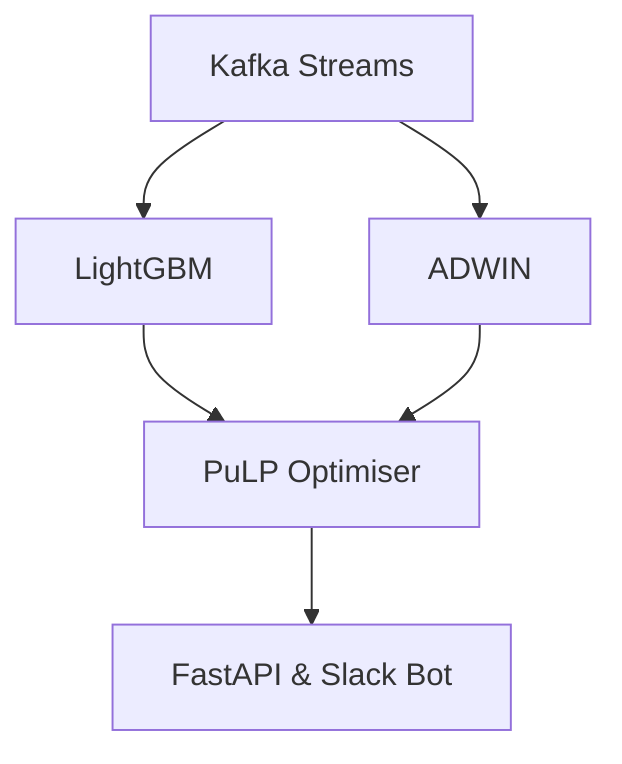

# Architecture Overview

## Components

- **Kafka**: Streams real-time events (orders, courier locations, weather)
- **ADWIN**: Drift detection for sudden demand spikes
- **LightGBM**: Nightly-trained 15-minute forecasting model
- **Optimiser**: MILP (PuLP + CBC), with greedy fallback if >2s
- **Exposure layer**: FastAPI endpoint returns a bonus matrix; Slack bot posts €/km changes with LLM explanation

## Optimization Objective

We solve:

minimize(α × bonus_cost + β × late_orders)

Subject to:
- Area fairness constraints
- Budget ceilings